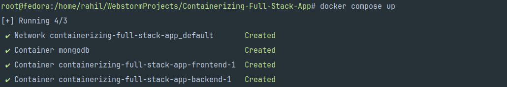

In this blog post, we'll explore how to containerize a full-stack application using Docker. We'll start with an introduction to Docker and gradually move towards containerizing our application into multiple containers.

## Table of Contents

1. [Introduction to Docker](#introduction-to-docker)
2. [Why Containerize?](#why-containerize)
3. [Requirements](#requirements)
4. [Getting Started](#getting-started)
5. [Containerizing a Full-Stack Application](#containerizing-a-full-stack-application)
   - [The Frontend](#the-frontend)
   - [Backend](#backend)
   - [The database](#the-database)
## Introduction to Docker

Docker is a platform for developing, shipping, and running applications in containers. Containers are lightweight, portable, and self-sufficient environments that contain everything needed to run an application, including code, runtime, system tools, and libraries. Docker provides a consistent environment across different systems, making it easy to develop and deploy applications.

Docker Compose is an extension of Docker that simplifies the management of multi-container applications. It allows you to define and run multi-container Docker applications using a YAML configuration file (docker-compose.yml). With Docker Compose, you can specify the services, networks, and volumes required for your application in a single declarative file, making it easy to understand and maintain your application's configuration.

One of the key benefits of Docker Compose is its ability to orchestrate the startup and shutdown of multiple containers with a single command. By running docker-compose up, Docker Compose reads the configuration file and starts all the containers defined in it, automatically setting up the necessary networks and volumes. Conversely, docker-compose down stops and removes all the containers, networks, and volumes associated with the application.

Additionally, Docker Compose provides features for managing service dependencies, environment variables, and override files. You can specify dependencies between services, ensuring that dependent services are started in the correct order and can communicate with each other. Docker Compose also supports environment variables and override files, allowing you to customize your application's configuration for different environments (e.g., development, staging, production)

## Why Containerize?

Containerization offers several benefits for developing and deploying applications:

- **Consistency**: Containers ensure consistent environments across development, testing, and production.
- **Isolation**: Each container runs independently, isolating applications from one another and the host system.
- **Portability**: Containers can run on any system that supports Docker, making it easy to move applications between environments.
- **Scalability**: Containers can be easily scaled up or down to meet changing demand.

## Requirements:

1.  In this demo, I am using a fullstack application with React(vite) in the frontend, Nodejs in backend and MongoDB as the database
2.  Docker engine or Desktop
3.  Text Editor or IDE 
4. Docker compose 

## Getting Started:

Clone the repository from [this repo](https://github.com/grahil-24/Containerizing-Full-Stack-App.git) and run the command "npm install" inside the Server and Frontend Folder to install the dependencies. 

    npm install

Here is what the folder structure should look like - 

{:height="450px" width="200px"}

## Containerizing a Full-Stack Application: 
After cloning the repo and installing the needed dependencies, we are going to start by building an image for the frontend and backend. 

1. #### The Frontend:

    Create a file named Dockerfile in the Frontend folder, and put the following content inside it.

        FROM node:latest
        WORKDIR /app
        COPY . .
        RUN npm install
        EXPOSE 3000
        CMD ["npm", "run", "dev","--","--host","0.0.0.0"]

    So lets have a look at this piece of code line by line - 

    1. FROM node:latest - it specifies that the base image will be built upon the latest version of node
    2. WORKDIR /app - It sets the /app within the container as the working directory. All the subsequent instructions below this will be executed within this directory. 
    3. COPY . . - it instructs docker to copy all the directory and files, in the directory dockerfile is present to the working directory in the container, which is /app. 
    4. RUN npm install - This command is run when the container is being built. This installs all the dependencies necessary to run the container successfully. 
    5. EXPOSE 3000 - It specifies that the container will listen on the specified port(s) at runtime. In our case it is 3000
    6. CMD ["npm", "run", "dev","--","--host","0.0.0.0"] - This command is run when the container starts. It specifies to start the vite server, which serves our frontend, and to listen on all available network interfaces. 

    After creating the dockerfile for frontend, it is now time to build the image. Open the terminal in your IDE and run the following commands - 

        cd ./Client/FrontEnd
        docker build -t rahilg24/21bcp239-frontend .
    
    Here you can replace rahilg24/21bcp239-frontend with any name you want. This will be the name of our image. Typically if you have created a docker account image of the name starts with {username}/{tag}. So it will be easier to push to remote repositories. After executing this commands, docker takes a minute to create the image. Run the following command to check if the docker image was created successfully - 

        docker images
    
    And you would be listed with all the docker images like so - 

    

    Now, to run the image in the terminal simply run the following code - 

        docker run -p 3000:3000 rahilg24/21bcp239-frontend
    
    Replace the name of image with yours. The p flag is used to expose the container port 3000 to the host system's 3000 port, so that we can access it outside the container. Try it out in your browser by typing "http://localhost:3000" and see the results!

     

    You wont be able to do anything on this app, as the backend server is not up yet. So lets do it, and using docker!!!

    Now lets stop the container for now. Run the following commands to view all running containers. 

        docker container ls

    Copy the container id of the container and run the following command to stop it

        docker container stop {cont_id}  
    
2. ### The Backend: 

    Containerizing of the backend is just same as that of the frontend. Create a docker file in the Server directory and put the following piece of code in it -

        FROM node:latest
        WORKDIR /app
        COPY . .
        RUN npm install
        EXPOSE 3001
        CMD ["npm", "run", "devStart"]

    The only difference is in the port and the run command. The backend will be exposed on the 3001 port. 

    Now the build command is the same too, just run the same command as we did in frontend and you are good to go! But dont forget to change your present working directory to Server in the terminal before running the command. 

        docker build -t rahilg24/21bcp239-backend .
    
    To verify that the image was built, run the command - 

        docker images
    

    Now start the container using the command as we did before. But this time it will be on port 3001 instead of 3000.

        docker run -p 3001:3001 rahilg24/21bcp239-backend

    Now the server is not serving or rendering anything, so run the frontend container too, to see the overall result. Now, we would be able to login and do some stuff. 

     

    Now still some features like adding reviews, reporting bugs would be locked as, we the database is inaccessible! Let us look at how we can containerize mongodb as well using docker compose. But first of all stop all the containers, as starting and stopping of containers will be handled by docker compose itself! Lets look at that in the next section

3. ### The database: 

    The good part is, we dont need to build an image for the database. We need to simply download the official image from remote repository. We dont even need to go to any site or do any git clone or anything like that to download it. All will be handled by docker itself! Let us look at how. 

    1. Create a docker-compose.yml in the main working directory of the project and put the following piece of code in it - 

            version: '3'

            services:
                frontend:
                    image: rahilg24/21bcp239-frontend
                    ports:
                    - "3000:3000"

                backend:
                    image: rahilg24/21bcp239-backend
                    ports:
                    - "3001:3001"
                    depends_on:
                    - mongodb

                mongodb:
                    image: mongo
                    container_name: mongodb
                    ports:
                    - "27017:27017"
                    environment:
                    - MONGO_INITDB_DATABASE=test
                    - MONGO_INITDB_ROOT_USERNAME=user
                    - MONGO_INITDB_ROOT_PASSWORD=pass

        In the services part we list all the images required with their configuration. We see that, we already include our backend and frontend images, with their exposed ports specified. Now, in backend we observe that there is an extra field 'depends_on'. What does it mean? Well when we start the multi-container which we will see in the future how, the dependencies of a service are started first. Thats it. It does not affect any form of inter-service communication.

        The third service, we have included is mongo. But we do not remember creating any mongo image or downloading it from any remote repo, right? Because docker will handle all that from us. First, it will search in our local repo, if an image named mongo exists, it will simply use that, or else it will download the image from the remote repository and run it in a container named mongodb, as specified in the 'container_name' field. Next we pass some environment variables,
        so we can connect to our mongodb cluster and database. Let us see how we can execute this docker-compose file
    
    
    2. Now to create a multi-container container, simply in your terminal change your present working directory to the directory where the docker-compose.yml is present and run the command-

            docker compose up
    
    {:height="950px" width="600px"}

    Now run the following command to view all the running containers - 

            docker container ls
        
    We observe that there are 3 containers running - one for the backend, one for the frontend and one for the database!!!

    {:height="950px" width="600px"}

4. Now visit 'http://localhost:3000/' in your browser, to access the whole applications, with all
    of its features unlocked!!

5. To stop the multi-container container simply run the command - 

        docker compose down

    {:height="950px" width="600px"}

### VOILA, WE HAVE SUCCESSFULLY CONTAINERIZED A FULL-FLEDGED WEB-APP!!

6. We can also observe that docker has automatically removed all the 3 containers. You can verify it by running the command - docker container ls

    

